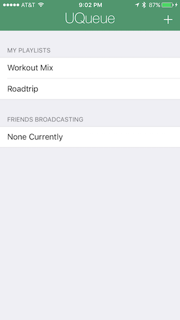
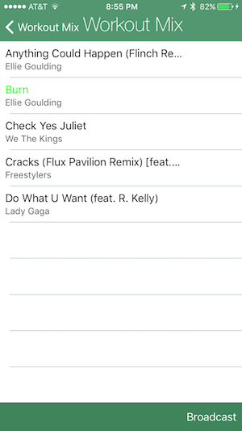

# uqueue  
##Screenshots  

  

##Proof of Concept
We originally intended to use Spotify's iOS API to take care of all of the music playing aspects of this app while we focused on establishing a means of communication between the users. Unfortunately, the documentation and framework was deprecated, so we instead had to spend a majority of our time building the music player from the ground up. This included the ability to create/save custom playlists.     
  
  
After creating a reasonable player interface, we implemented user authentication using Facebook and Firebase. The use of Facebook makes it easy to connect to your Facebook friends who also have the app. The user can either choose to broadcast their own playlist so that their friends can follow along, or if a friend is broadcasting and they have been invited, the user can view that friend's playlist. User's have the ability to like/dislike songs on a playlist being broadcasted to them, and these numbers will be updated in real-time across all devices currently viewing the same playlist. We also implemented a basic song request feature where a user could send a host a song suggestion. All broadcasted information is stored in a Firebase database allowing information to flow between users. Ultimately, the application is not in a state to be used widely, but it serves as a proof of concept for our idea to take the stress of a party's host/dj and serves as an effective means of aggregating user feedback.   

####Features Not Implemented (Yet)
- The ability for the queue to automatically rearrange songs based on number of likes/dislikes
- Ability to add a song directly from the song request list
- Broadcast doesn't update if a new song is added, it only keeps the list of songs present when the broadcast button was pressed
- Push notifications for invites
